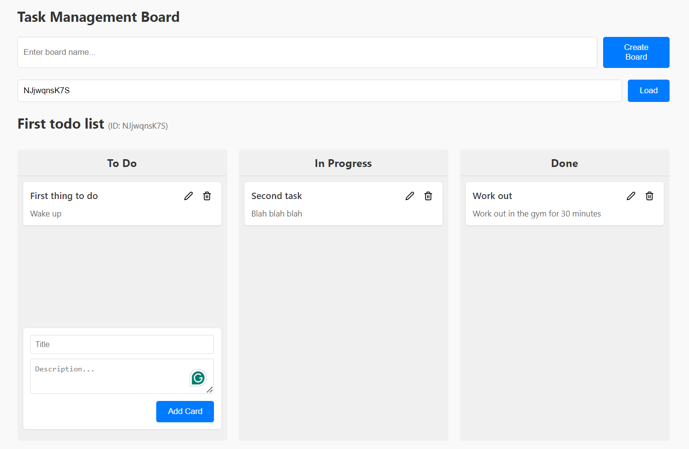

# Task Management Board Application

A full-stack task management application built with React, TypeScript, MongoDB, and Express. This project allows users to create boards and manage tasks using a drag-and-drop interface across different status columns (To Do, In Progress, Done).

## Live Demo



- Frontend: [Task Management Boards](https://task-management-boards.vercel.app)
- Backend API: [Task Management API](https://task-management-boards-api.vercel.app)

## Features

- Create and manage multiple task boards
- Add, edit, and delete task cards
- Drag and drop cards between columns (To Do, In Progress, Done)
- Reorder cards within columns
- Persistent storage with MongoDB
- Responsive design

## Tech Stack

### Frontend

- React 19 with TypeScript
- Redux Toolkit for state management
- Styled-components for styling
- DND Kit for drag-and-drop functionality
- Axios for API requests
- Vite for build and development

### Backend

- Node.js with Express
- TypeScript
- MongoDB with Mongoose
- RESTful API architecture
- Serverless deployment on Vercel

## Getting Started

### Prerequisites

- Node.js (v16 or higher)
- MongoDB (local or Atlas)

### Setup and Installation

#### Backend

1. Navigate to the backend directory:

   ```bash
    cd backend
   ```

2. Install dependencies:

   ```bash
    npm install
   ```

3. Create a `.env` file in the root of the backend directory and add your MongoDB connection string:

   ```
    MONGODB_URI=your_mongodb_connection_string
    PORT=5000
    NODE_ENV=development
   ```

4. Start development server:

   ```bash
    npm run dev
   ```

#### Frontend

1. Navigate to the frontend directory:

   ```bash
    cd frontend
   ```

2. Install dependencies:

   ```bash
    npm install
   ```

3. Create a `.env` file in the root of the frontend directory and add your backend API URL:

   ```
    VITE_API_URL=http://localhost:5000/api
   ```

4. Start development server:

   ```bash
    npm run dev
   ```

5. Open your browser and navigate to `http://localhost:5173` to view the application.

## API Endpoints

### Boards

- GET /api/boards - Get all boards
- POST /api/boards - Create a new board
- GET /api/boards/:id - Get a board by ID
- DELETE /api/boards/:id - Delete a board

### Tasks

- GET /api/cards/board/:boardId - Get all cards for a board
- POST /api/cards - Create a new card
- PUT /api/cards/:id - Update a card
- DELETE /api/cards/:id - Delete a card
- PUT /api/cards/reorder - Reorder cards (drag and drop)
